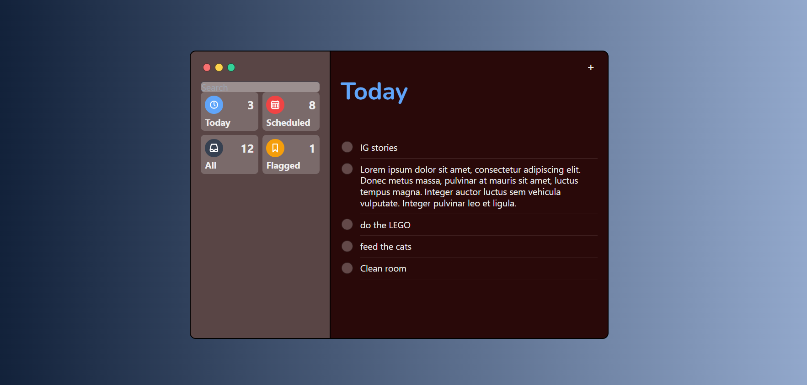

# Copy iOS Reminder App Design (HTML & CSS)
================================================

This project is a design concept for iOS Reminder app, which I used for learning HTM and CSS.
You can try click or just

**Screenshots:** 

**Description:**

This is a small project I created to learn HTML and explore design possibilities using CSS. It does not contain any functionalities, but showcases a visual representation of a reminder app.

**How to View the Design:**

1. **Clone the repository:** (assuming you have Git installed)

    ```bash
    git clone [https://github.com/misslittlebee/reminerappdesign.git](https://github.com/misslittlebee/reminerappdesign.git)
    ```

2. **Open in browser:**

    - Open the project folder in your preferred code editor.
    - Open `reminderapp.html` in your web browser.

**Enjoy!**

**Created by:** MissLittleBee 
www.github.com/MissLittleBee
